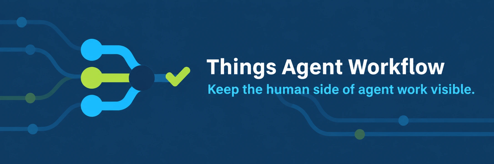

# Things Agent Workflow

Things Agent Workflow keeps the human side of parallel agent work visible. Jira remains the
team work system. Things records the decisions, messages, approvals, follow-ups, and access
changes that require Nick or Nick plus an agent.

The service provides semantic MCP tools instead of unrestricted task mutation. It prevents
duplicate handoffs with stable keys, serializes writes from concurrent agents, and validates
destinations and tags before opening Things. It writes through the official
[Things URL Scheme](https://culturedcode.com/things/support/articles/2803573/) and reads every
submitted change back from the Things database before reporting success.

## Boundary

Create a handoff only when a specific human action is required:

- Put team delivery scope and shared backlog in Jira.
- Keep agent-only work in the session, worktree, or repository handoff.
- Put Nick-only and Nick-plus-agent obligations in Things.
- Record final project decisions in their authoritative repository or delivery system before
  completing the Things handoff.

The server never stores or returns the Things authorization token. Automated tests use an
in-memory gateway and do not open Things or modify the live database.

## Tools

| Tool                       | Purpose                                                                                                       |
| -------------------------- | ------------------------------------------------------------------------------------------------------------- |
| `capture_handoff`          | Create one keyed task, decision, message, review, approval, unblock, follow-up, publish, or joint obligation. |
| `resume_handoff`           | Recover the current handoff packet by item ID or stable key.                                                  |
| `transition_handoff`       | Move a managed handoff to ready, waiting, deferred, or complete.                                              |
| `review_handoffs`          | Group open obligations into the queues that need human attention.                                             |
| `build_workstream_project` | Create a Things project with the standard human-control headings.                                             |
| `workflow_status`          | Check Things read access and the required local tags without exposing task content.                           |

## Documentation

| Read this                                  | When you need to                                                                       |
| ------------------------------------------ | -------------------------------------------------------------------------------------- |
| [Getting started](docs/getting-started.md) | Install the server and skills, configure a host, and verify read access.               |
| [Tool reference](docs/tool-reference.md)   | Check every parameter, return shape, validation rule, and error.                       |
| [Workflows](docs/workflows.md)             | Follow examples for reminders, decisions, waiting, deferral, completion, and projects. |
| [Operations](docs/operations.md)           | Reconcile uncertain writes, troubleshoot failures, or change runtime configuration.    |
| [Architecture](docs/architecture.md)       | Understand lifecycle, notes, verification, and concurrency.                            |
| [Contributing](CONTRIBUTING.md)            | Change the service without crossing the live-write boundary.                           |
| [Changelog](CHANGELOG.md)                  | See released and unreleased behavior changes.                                          |

## Quick start

Keep the general-purpose `things-mcp` server installed. This server sits beside it and owns
only the managed human-agent workflow.

```sh
git clone git@github.com:NickCrew/things-agent-workflow.git
cd things-agent-workflow
uv sync --frozen
uv run fastmcp call \
  --command '/opt/homebrew/bin/uv run things-agent-workflow' \
  --target workflow_status \
  --json
```

The status call is read-only. Continue with [Getting started](docs/getting-started.md) for the
Codex and Claude configurations, skill links, Things URL setup, and expected output.

The project builder creates the workstream and standard headings in one Things JSON request.
Add initial handoffs through `capture_handoff` so each task receives its own stable key and
can be verified independently.

## Development

Requires macOS, Things 3, and `uv`.

```sh
uv sync --frozen
uv run pytest --cov=things_agent_workflow --cov-report=term-missing
uv run ruff check .
uv build
```

Run the MCP server over stdio:

```sh
uv run things-agent-workflow
```

Do not run a live write as a smoke test unless the user has authorized that specific Things
mutation. Unit and MCP integration tests stay local and side-effect free.
